# Задание 
https://github.com/netology-code/virtd-homeworks/blob/shvirtd-1/05-virt-04-docker-in-practice/README.md

# shvirtd-example-python

Учебный проект FastAPI-приложения для изучения Docker Compose.

## Описание проекта

Это простое веб-приложение на FastAPI, предназначенное для изучения контейнеризации и работы с Docker Compose. Приложение демонстрирует:

- Создание веб-сервиса на FastAPI
- Подключение к базе данных MySQL
- Работу с прокси-серверами (Nginx → HAProxy → FastAPI)
- Корректную настройку сетей Docker
- Передачу IP-адресов через заголовки прокси

### Функциональность

При обращении к главной странице приложение:
1. Определяет IP-адрес клиента
2. Записывает время запроса и IP-адрес в базу данных MySQL
3. Возвращает эту информацию пользователю

**Важно для обучения:** Если обращаться к приложению напрямую (минуя прокси), вы получите подсказку о неправильном выполнении задания.

## Способы запуска

### 1. Запуск через Docker Compose

**Архитектура при запуске через Docker Compose:**
```
Клиент → Nginx (8090) → HAProxy (8080) → FastAPI App (5000) → MySQL
```

### 2. Локальный запуск для разработки

```bash
# Создайте виртуальное окружение
python3 -m venv venv
source venv/bin/activate  # в Windows: venv\Scripts\activate

# Установите зависимости
pip install -r requirements.txt

# Настройте переменные окружения для подключения к БД(не забудьте отдельно запустить БД)
export DB_HOST='127.0.0.1'
export DB_USER='app'  
export DB_PASSWORD='very_strong'
export DB_NAME='example'

# Запустите приложение
uvicorn main:app --host 0.0.0.0 --port 5000 --reload
```

**Требования для локального запуска:**
- Python 3.12+
- Запущенный сервер MySQL
- База данных и пользователь, настроенные согласно переменным окружения

## Настройка базы данных MySQL

```sql
CREATE DATABASE example;
CREATE USER 'app'@'localhost' IDENTIFIED BY 'very_strong';
GRANT ALL PRIVILEGES ON example.* TO 'app'@'localhost';
FLUSH PRIVILEGES;
```

## Доступные эндпоинты

- `GET /` - главная страница (записывает запрос в БД и возвращает время + IP)
- `GET /requests` - просмотр всех записей из базы данных  
- `GET /debug` - отладочная информация о заголовках запроса
- `GET /docs` - автоматическая документация FastAPI (Swagger UI)

## Переменные окружения

| Переменная | Значение по умолчанию | Описание |
|------------|----------------------|----------|
| `DB_HOST` | `127.0.0.1` | Хост базы данных MySQL |
| `DB_USER` | `app` | Пользователь БД |
| `DB_PASSWORD` | `very_strong` | Пароль БД |
| `DB_NAME` | `example` | Имя базы данных |

## Проверка работы

```bash
# При правильной настройке через прокси
curl http://localhost:8090

# При прямом обращении (НЕПРАВИЛЬНО) 
curl http://localhost:5000  
# Получите подсказку о том, что нужно использовать порт 8090
```

## Лицензия

Этот проект распространяется под лицензией MIT (подробности в файле `LICENSE`).


# Задание
# 1. Запустим пророект локально


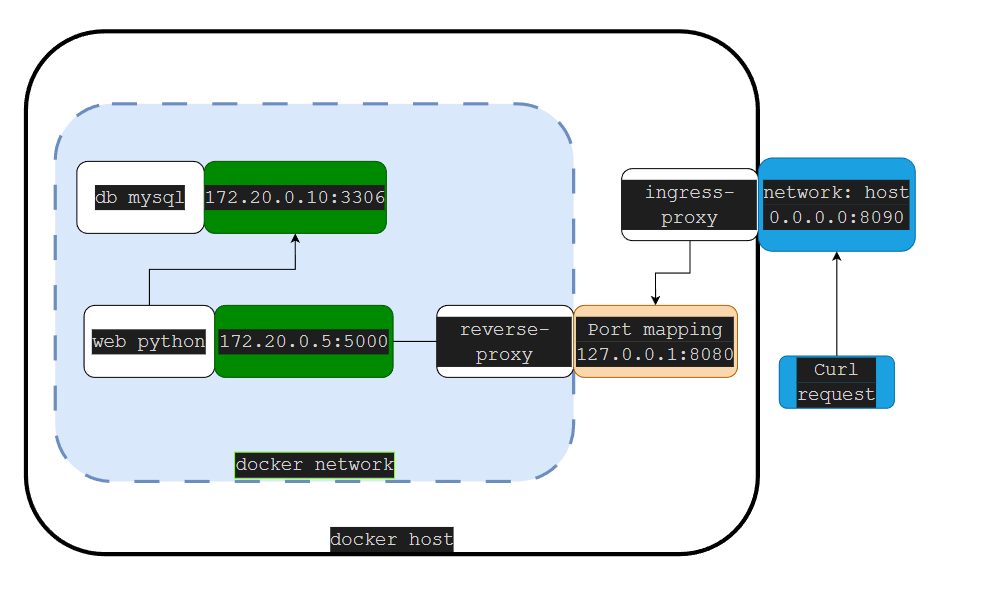
## 1.1 Соберем образ 
```
docker build -f Dockerfile.python --network host -t myapp:latest .
```
```
 docker compose up -d

```

## потестируем
```
 docker exec -it shvirtd_app bash
 ```
 сначала локально 
```
curl -H "X-Real-IP: 192.168.31.11" http://localhost:5000
```

```
 docker exec -it shvirtd_db mysql -u app -pvery_strong example
 ```

```
SHOW DATABASES;
````
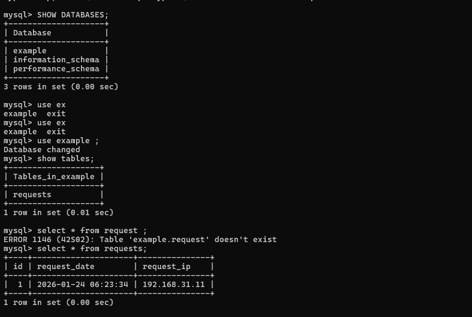


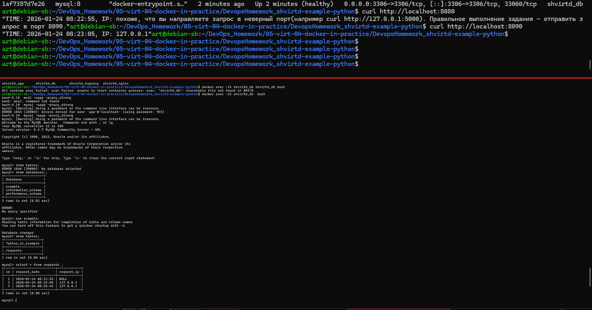

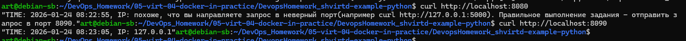

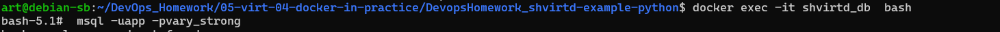


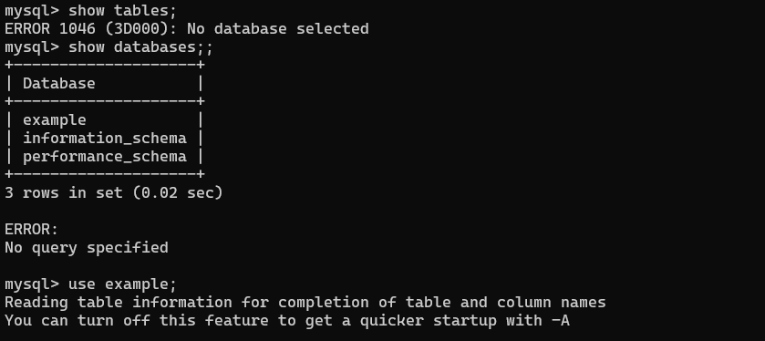

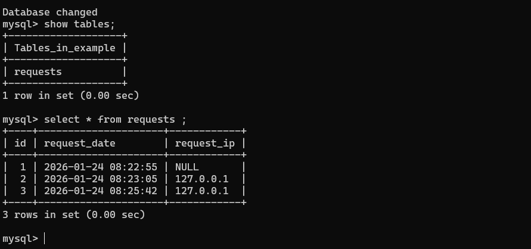


# 2. Создание Container Registry в Yandex Cloud

## Установим YC
```
curl https://storage.yandexcloud.net/yandexcloud-yc/install.sh | bash

# Инициализация профиля
yc init

#  Создание registry с именем test
yc container registry create --name test

# Проверка создания
yc container registry list
```

```
yc resource-manager folder create --name my-new-folder-regstry
```
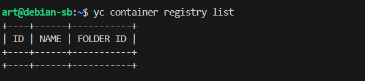
```
yc resource-manager folder list
#переход в дирректорию
yc config set folder-name my-new-folder-regstry

```

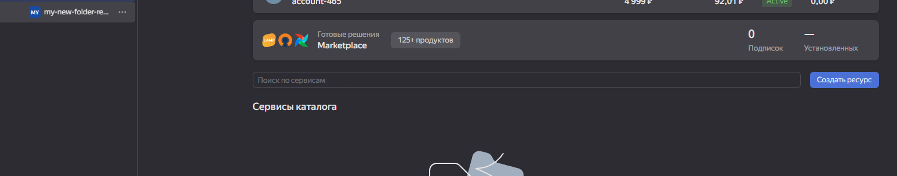

```
yc container registry create --name test --folder-name my-new-folder-regstry
```
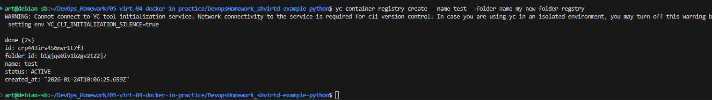

### Получить ID registry
```
yc container registry get test --folder-name my-new-folder-regstry
```
```
yc container registry list
```
```
yc container registry list --folder-name my-new-folder-regstry
```
### авторизации Docker в Yandex Container Registry:
```
yc container registry configure-docker --folder-name my-new-folder-regstry
```
```
yc container registry get test
```
## Команда для сборки образа 
```
docker build -f Dockerfile.python -t cr.yandex/crp443irs456mvr1t7f3/myapp:latest .
```

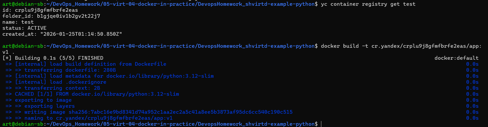


```
REGISTRY_ID=$(yc container registry get test --format json | jq -r '.id')
echo "Registry ID: $REGISTRY_ID"
```
```
docker push cr.yandex/$REGISTRY_ID/myapp:latest
```


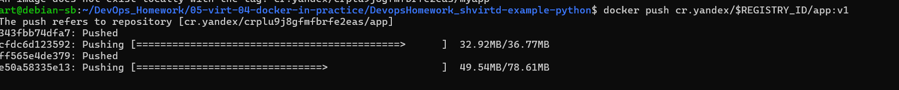


###  Сканирование

Команда для включения автоматического сканирования в Yandex Container Registry:

```
 yc container image list --repository-name /$REGISTRY_ID/app

```
```
yc container image scan crp1vk3n4db5n0hes5mt
```
```
yc container image list-vulnerabilities crp1vk3n4db5n0hes5mt
```

## список уязвимостей
```
 yc container image list-vulnerabilities crp1vk3n4db5n0hes5mt --scan-result-id che24608ign8h8ccjp2u
 ``````
УСТАНОВИМ trivy
```
curl -sfL https://raw.githubusercontent.com/aquasecurity/trivy/main/contrib/install.sh | sudo sh -s -- -b /usr/local/bin && trivy image cr.yandex/crplu9j8gfmfbrfe2eas/myapp:latest
```

```
echo "Scanning image for vulnerabilities..."
trivy image --format json --output trivy-report.json cr.yandex/$REGISTRY_ID/myapp:latest
trivy image --format table cr.yandex/$REGISTRY_ID/app:v1

echo "Report saved to trivy-report.json"
```
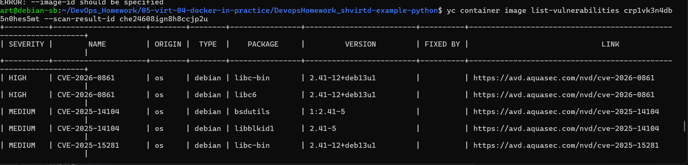

```
yc container image list
```
        
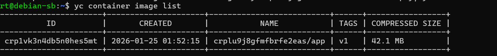


```
yc container image delete crp1vk3n4db5n0hes5mt

# Потом удалить registry
yc container registry delete crplu9j8gfmfbrfe2eas
```


# Задание 3

```
docker compose -f compose_include.yaml up -d
```
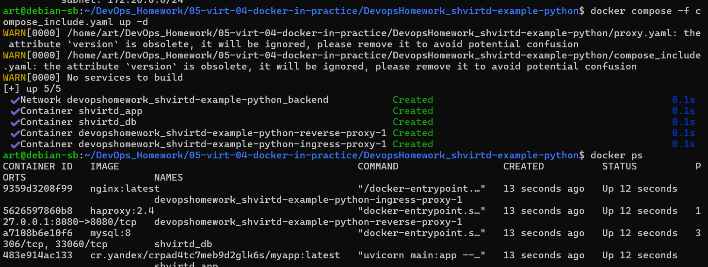

```
curl -L http://127.0.0.1:8090
```
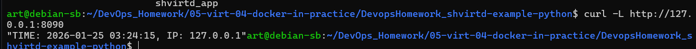

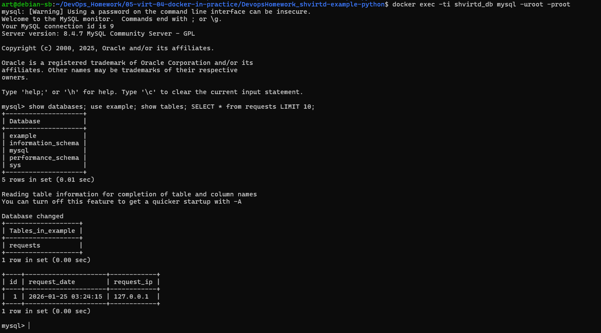


# Задача 4
## Созадим ВМ YC
```
yc compute instance create --name docker-vm --zone ru-central1-a --memory 2GB --cores 2 --create-boot-disk size=20GB,type=network-ssd --network-interface subnet-name=default,nat-ip-version=ipv4 --ssh-key ~/.ssh/id_ed25519.pub
```
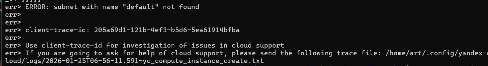
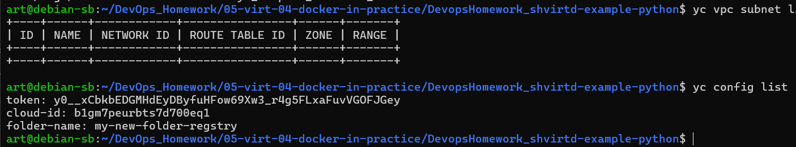

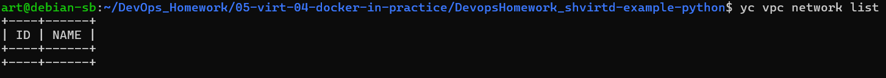
```
yc vpc network create --name net --folder-name my-new-folder-regstry
```
```
yc vpc subnet create --name default --zone ru-central1-a --network-name net --range 192.168.10.0/24 --folder-name my-new-folder-regstry
```
## Комментарий: Создает ВМ с использованием созданной подсети "default" в указанной папке.
```
yc compute instance create --name docker-vm --zone ru-central1-a --memory 2GB --cores 2 --create-boot-disk size=20GB,type=network-ssd --network-interface subnet-name=default,nat-ip-version=ipv4 --ssh-key ~/.ssh/id_ed25519.pub --folder-name my-new-folder-regstry
```
```
yc compute instance list
```
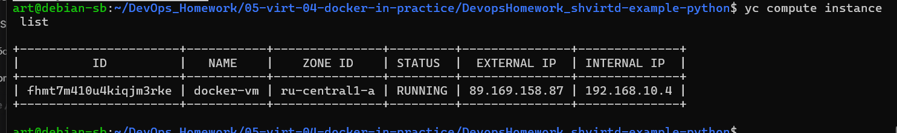


```

ssh -i ~/.ssh/id_ed25519 yc-user@89.169.158.87
```
установим докер
```
sudo curl -L "https://github.com/docker/compose/releases/latest/download/docker-compose-linux-$(uname -m)" -o /usr/local/lib/docker/cli-plugins/docker-compose && sudo chmod +x /usr/local/lib/docker/cli-plugins/docker-compose
```
Добавляет текущего пользователя в группу docker для работы без sudo и применяет изменения.
```
sudo usermod -aG docker $USER && newgrp docker
```
```
sudo mkdir -p /opt/project && sudo chown $USER:$USER /opt/project
```
Качаем проект
```
git clone https://github.com/htment/DevopsHomework_shvirtd-example-python.git /opt/project
```
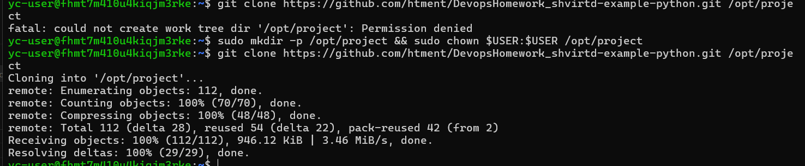

### Запускаем проект
```
cd /opt/project && docker compose -f compose_include.yaml up -d
```
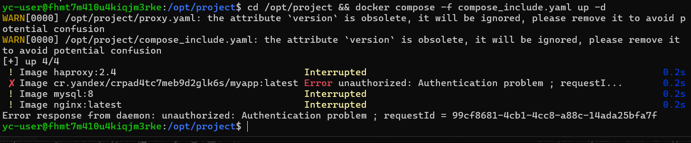

копируем с хостовой машины
```
scp -i ~/.ssh/id_ed25519 ~/.docker/config.json yc-user@89.169.158.87:~/.docker/
```

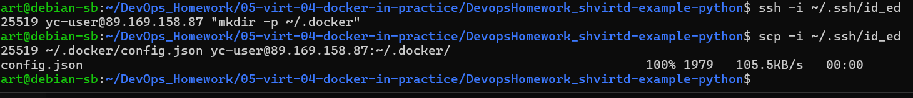
```
docker compose -f compose_include.yaml up -d
```
опять ошибка
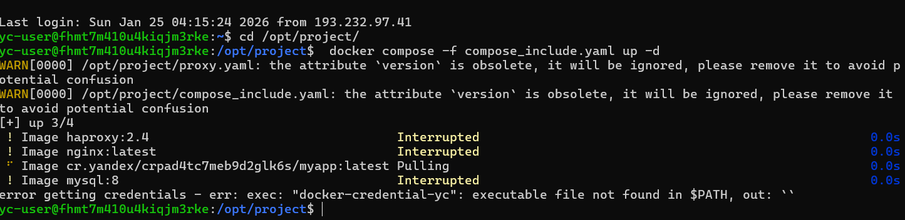

```
sudo apt install pass -y
```

```
curl -s https://storage.yandexcloud.net/yandexcloud-yc/install.sh | bash -s -- -a
```
```
 yc init --folder-name my-new-folder-regstry
 ```

 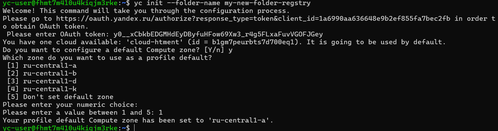
ИИ - победил

 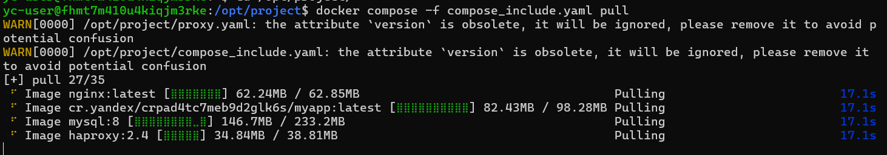

 ```
 curl -L http://localhost:8090
 ```

 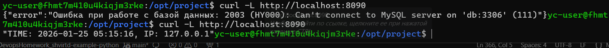


```
  curl -L http://89.169.158.87:8090
```

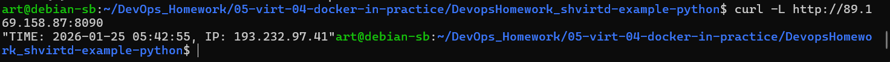